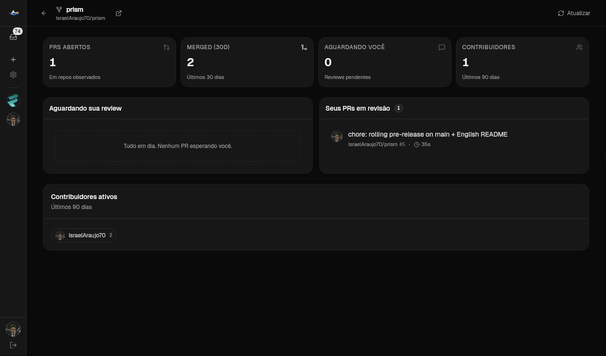
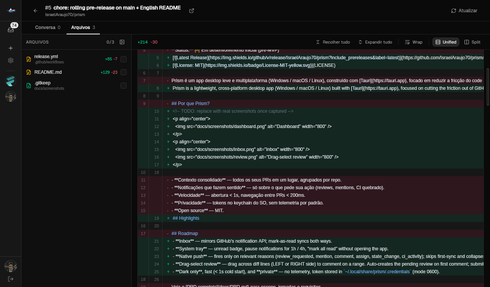

# Prism

> A native desktop client for GitHub Pull Requests that lives in your tray and notifies you only about what matters.

[](https://github.com/IsraelAraujo70/prism/releases/latest)
[](LICENSE)

Prism is a lightweight, cross-platform desktop app (Windows / macOS / Linux) built with [Tauri](https://tauri.app), focused on cutting the friction out of GitHub code review. It consolidates PRs across multiple repos and orgs, surfaces CI status, and fires native OS notifications only for the events that need your attention.

<p align="center">
  
</p>
<p align="center">
  
</p>

## Highlights

- **Inbox** — mirrors GitHub's notification API; mark-as-read syncs both ways.
- **System tray** — unread badge, pause notifications for 1h / 4h, "mark all read" without opening the app.
- **Native push** — fires only on relevant reasons (review_requested, mention, comment, assign, state_change, ci_activity); skips first-sync and collapses bursts > 3.
- **Drag-select review** — drag across diff lines (LEFT or RIGHT side) to comment on a range. Auto-creates the pending review on first comment; submit with Approve / Comment / Request Changes.
- **Dark only**, fast (< 1s cold start), and **private** — no telemetry, token stored in `~/.local/share/prism/.credentials` (mode 0600).

## Install

> All install URLs below use **version-agnostic** asset names served by GitHub's `latest/download/...` endpoint, so they don't break on the next release.

### Fedora / RHEL / openSUSE (RPM)

```bash
sudo dnf install https://github.com/IsraelAraujo70/prism/releases/latest/download/Prism-x86_64.rpm

# Runtime deps (only if missing)
sudo dnf install libayatana-appindicator-gtk3 webkit2gtk4.1 gtk3
```

> A proper DNF repo (Copr or GitHub Pages) is on the roadmap so you can `dnf install prism` and get auto-updates. For now the URL above always resolves to the latest stable.

### Debian / Ubuntu (DEB)

```bash
curl -L -o /tmp/prism.deb https://github.com/IsraelAraujo70/prism/releases/latest/download/Prism_amd64.deb
sudo apt install /tmp/prism.deb
```

### Linux (AppImage)

```bash
curl -L -o ~/.local/bin/Prism.AppImage \
  https://github.com/IsraelAraujo70/prism/releases/latest/download/Prism_amd64.AppImage
chmod +x ~/.local/bin/Prism.AppImage
~/.local/bin/Prism.AppImage
```

### macOS (universal — Apple Silicon + Intel)

The build is currently **unsigned**, so Gatekeeper will refuse the first launch. Either:

```bash
xattr -cr /Applications/Prism.app
```

or right-click the app → *Open* → confirm in the dialog. Code signing will land once an Apple Developer cert is wired into CI.

```bash
curl -L -o /tmp/Prism.dmg \
  https://github.com/IsraelAraujo70/prism/releases/latest/download/Prism_universal.dmg
open /tmp/Prism.dmg
# drag Prism.app to /Applications, then:
xattr -cr /Applications/Prism.app
open /Applications/Prism.app
```

### Windows

Not built yet. Building locally with `bun run tauri build` works (see below); a native CI pipeline is coming.

## First launch

1. Click **Sign in with GitHub** — opens your browser via OAuth Device Flow (no client secret, public client_id).
2. Add the repos you want to watch via the **+** in the sidebar.
3. Background sync starts immediately. Notifications begin arriving on the next event.

## Build from source

Requires:
- [Rust](https://rustup.rs) ≥ 1.77
- [Bun](https://bun.sh) (or Node 22+ — but `bun.lock` is the source of truth)
- Linux: `libwebkit2gtk-4.1-dev`, `libgtk-3-dev`, `libayatana-appindicator3-dev`, `librsvg2-dev`, `patchelf`, `rpm` (for `--bundles rpm`)

```bash
git clone https://github.com/IsraelAraujo70/prism
cd prism
bun install
bun run tauri:dev          # dev build with hot reload
bun run tauri build        # release build; bundles in src-tauri/target/release/bundle/
```

The `tauri:dev` script sets `WEBKIT_DISABLE_DMABUF_RENDERER=1` for Linux Wayland sessions; the release binary bakes the same workaround.

## Project layout

```
src-tauri/src/
  lib.rs            # Tauri builder, command registry, tray, window event hooks
  commands.rs       # #[tauri::command] handlers (thin orchestration)
  github.rs         # GitHub HTTP client + Device Flow + GraphQL helper
  notifications.rs  # background sync loop + push filtering / pause
  tray.rs           # tray icon + menu + tooltip updates
  db.rs             # SQLite init + CRUD for watched repos, notifications, mutes
  auth.rs           # token storage (file mode 0600)
  error.rs          # AppError enum

src/
  App.tsx           # top-level state machine; sidebar shell
  lib/api.ts        # typed wrappers around invoke()
  components/
    pr-viewer.tsx   # PR detail + tabs + submit-review panel
    diff-viewer.tsx # diff renderer + drag-select for review comments
    inbox.tsx       # GitHub-equivalent inbox
    ...
```

## Status

- ✅ Notifications, tray, drag-select review (v0.1.1)
- ⏳ Deep-link from native notification body click (needs custom URI scheme)
- ⏳ Edit / delete pending review comments before submit
- ⏳ Code signing for macOS / Windows
- ⏳ Proper DNF repo (Copr) for `dnf install prism`

See [`docs/PRD.md`](docs/PRD.md) for the full product scope.

## Contributing

Issues, ideas and PRs are welcome. The codebase follows two patterns documented under `.claude/skills/prism-feature` and `.claude/skills/prism-design` (full-stack feature flow + design tokens).

If you're hacking on the UI, communicate with the user in PT-BR but keep all code, identifiers, and commit messages in English.

## License

[MIT](LICENSE) — © Israel Araujo de Oliveira
